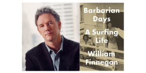

{: .image-float-left}Our November 30th event is shaping up nicely! We are delighted to welcome **William Finnegan** to the November 30th Books & Spirits. William is the author of _Barbarian Days: A Surfing Life_, which won the 2016 Pulitzer Prize for Autobiography!

He is also the author of _Cold New World_, _A Complicated War_, _Dateline Soweto_ and _Crossing the Line._ He has twice been a National Magazine Award finalist and has won numerous journalism awards, including two Overseas Press Club awards since 2009. _Barbarian Days: A Surfing Life_ received the 2016 Pulitzer Prize for Autobiography. A staff writer at The New Yorker since 1987, he lives in Manhattan.

Our mixologist and food sponsor for the November event is The Nook! The Nook won the Honolulu Star-Advertiser's **Critic’s Choice I’lima Award** for Best Casual Restaurant in 2015. We're looking forward to see what co-owners Anicea Campanale and Hailey Berkey whip up!

We hope you can join us! [Tickets here](https://www.eventbrite.com/e/books-spirits-wauthor-william-finnegan-tickets-29146985418?aff=website). Be sure to get a ticket that includes a signed copy of the book!
