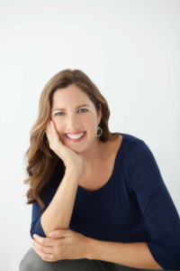

Our fourth event will combine body, mind and spirit through a pair of unique and insightful authors.

{: .image-float-right}

**Douglas Abrams** is the co-author (together with His Holiness the Dalai Lama and the Archbishop Desmond Tutu) of _The Book of Joy._ _The Book of Joy_ explores how we might find joy in the face of life's inevitable suffering. Douglas is the founder and president of Idea Architects, a creative book and media agency helping visionaries to create a wiser, healthier, and more just world. He is also the co-founder with Pam Omidyar and Desmond Tutu of HumanJourney.com, a public benefit company working to share life-changing and world-changing ideas. Doug has worked with Desmond Tutu as his cowriter and editor for over a decade, and before founding his own literary agency, he was a senior editor at HarperCollins and also served for {: .image-float-left} nine years as the religion editor at the University of California Press.

**Rachel Carlton Abrams** ("Doctor Rachel") is the author of _BodyWise: Discovering Your Body’s Intelligence for Lifelong Health and Healing_. She graduated Phi Beta Kappa from Stanford University, received her MD from UC San Francisco and a Master’s Degree in Holistic Health from UC Berkeley. She is Board Certified in Family Medicine and Integrative Medicine. In 2008 she opened the award-winning Santa Cruz Integrative Medicine Clinic. Dr. Abrams treats many of the world’s most influential people, from CEOs to billionaire entrepreneurs to Nobel Peace laureates. She has been voted “Best Doctor” in Santa Cruz County every year, from 2009–2016.

(Unfortunately Archbishop Tutu and His Highness the Dalai Lama will only be joining us in spirit).

{: .image-float-right}Doug and Rachel are married as you may have guessed. Having them together on stage offers a unique opportunity to explore the connection between body and spirit in a literary context. They'll probably surprise us. We expect to laugh a lot. We hope you'll join us.

Cocktails and pupus will be provided by [Koko Head Cafe](http://kokoheadcafe.com/). [Ocean Vodka](http://www.oceanvodka.com/) is graciously providing us with spirits!

Your ticket includes two drinks, food, and admission to the event at 7PM. There are a limited number of early admission tickets for a small group social with the authors before the main event at 6:00PM.

The event will be held at [RevoluSun Smart Home](http://www.revolusun.com/) in Kaka’ako. ([Map](https://www.google.com/maps/place/RevoluSun+Smart+Home/@21.2946221,-157.8616958,16.19z/data=%214m13%211m7%213m6%211s0x7c006df1f8650d73:0x4a05964d0c67c39f%212sRevoluSun+Smart+Home%213b1%218m2%213d21.2954579%214d-157.858027%213m4%211s0x7c006df1f8650d73:0x4a05964d0c67c39f%218m2%213d21.2954579%214d-157.858027)). Mahalo RevoluSun Smart Home for making the space available!
