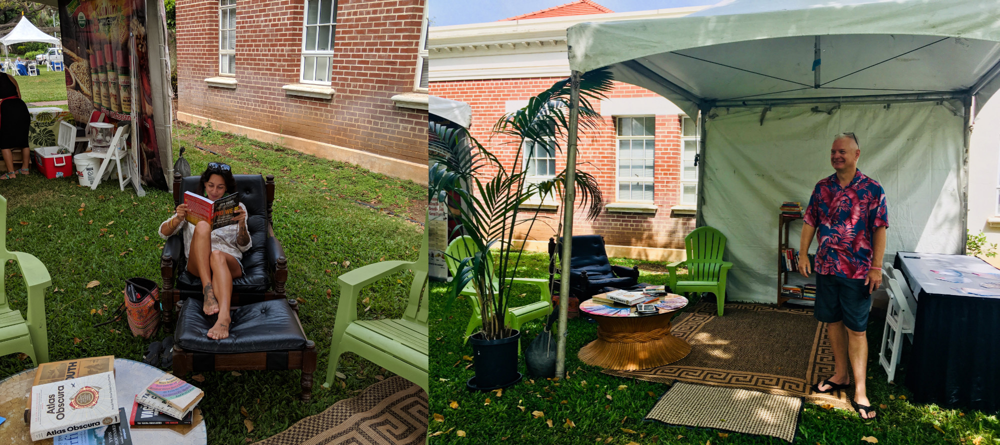
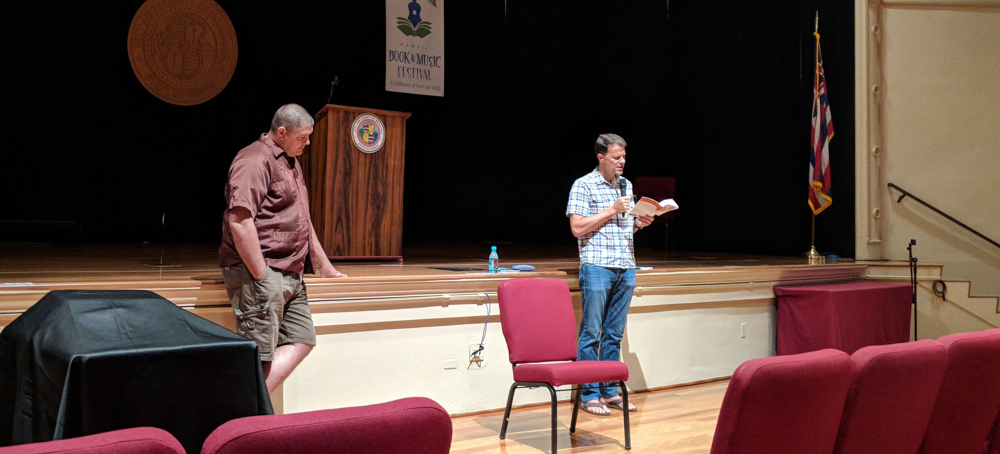

Aloha!

Sorry for our long absence! Stuart and Mark have both had crazy travel schedules....But fear not! Books & Spirits will return, we are plotting an event in August! Details below....

Meanwhile, we had a great time at **The Hawaii Books & Music Festival**!  It has been wonderful collaborating with Roger Jellinek and the HBMF, and we were stoked to see Books & Spirits authors Adam Johnson and Bill Finnegan at the Festival! Stuart introduced Adam, who gave a riveting talk about his novel The Orphan Master’s Son, life in North Korea and the thin line between reality and fiction there.  Bill talked about his memoir Barbarian Days and the fickle nature of memory. Both authors enthralled their audience.

Mark's social reading app [Bookship](https://www.bookshipapp.com) had a booth at the festival. Bookship lets you share your reading experiences with your friends and family - it's like a virtual book club on your phone. We demonstrated the app for folks and the inimitable Justine Espiritu set up a pop-up reading library in the booth.

And...we're delighted to host Dr. Marcus Eriksen, author of [Junk Raft](https://www.amazon.com/Junk-Raft-Activism-Plastic-Pollution-ebook/dp/B01I85NQ90/ref=as_li_ss_tl?ie=UTF8&qid=1526578221&sr=8-1&keywords=junk+raft&linkCode=ll1&tag=codexmap-20&linkId=237da82a9b57d36251c1e89e5035ed09), on August 28th, at our next Books & Spirits!

Marcus is an environmental scientist, educator and author committed to building stronger communities through art, science, adventure and activism. In 2008 Marcus and Joel Paschal sailed from Los Angeles to Hawaii on the Junk, “a raft made from plastic bottles, with thirty old sailboat masts for a deck and a Cessna 310 airplane as a cabin.” _Junk Raft_ tells the story.

We're excited for the event and will provide more details as we get closer!
