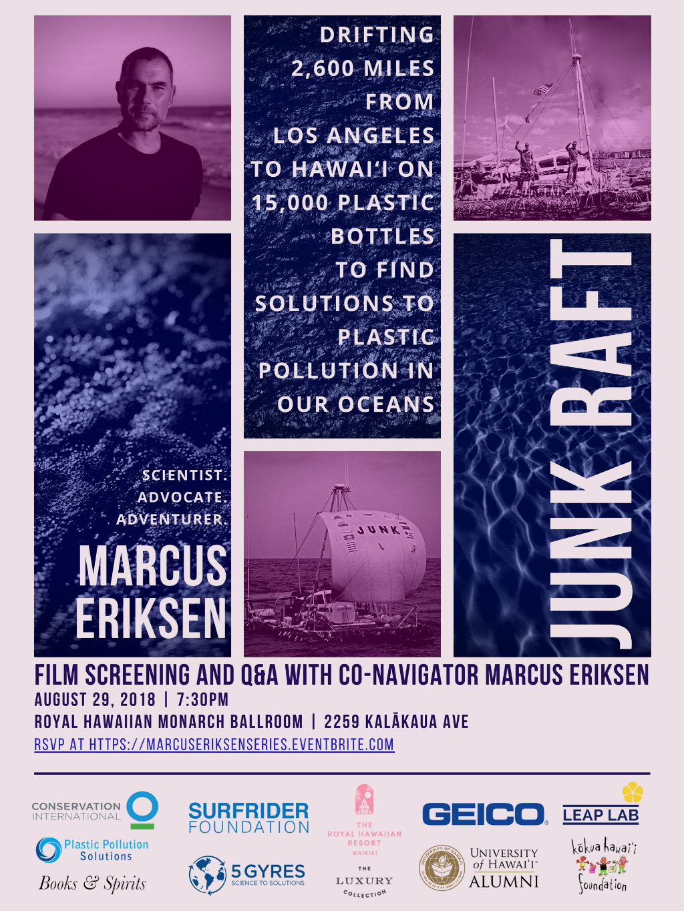

Aloha!

Books & Spirits is delighted to get back in action! In partnership with the University of Hawaii at Mānoa Better Tomorrow Speaker Series, we're delighted to host Marcus Eriksen, author of Junk Raft, in a [very special event](https://marcuseriksenseries.eventbrite.com) at the Royal Hawaiian Hotel on August 29th. You can register here: [https://marcuseriksenseries.eventbrite.com.](https://marcuseriksenseries.eventbrite.com)

Marcus Eriksen is an environmental scientist, educator and author committed to building stronger communities through art, science, adventure and activism.  His books chronicle rafting adventures down rivers and across oceans, and highlight his experience as a veteran of war and as a scientist for conservation.

In 2008, he and his co-navigator, Joel Paschal, constructed a “junk raft” made of plastic trash and set themselves adrift from Los Angeles to Hawaii, with no motor or support vessel, confronting perilous cyclones, food shortages, and a fast decaying raft. Floating on 15,000 plastic bottles and a Cessna airplane fuselage as a cabin, they journeyed 2,600 miles in 88 days, bringing attention to challenges of plastics pollution and the work of the 5 Gyres Institute, the organization he co-founded with his wife Anna Cummins.

To celebrate the 10th anniversary of his journey, there will be a special screening of the new film Junk Raft, followed by a Q&A with Dr. Eriksen. The event is FREE! There will be a cash bar and light pupus. Copies of Junk Raft will be available for purchase at the event. As the event is free and space is limited, we encourage you to reserve your spot on Eventbrite as soon as possible!

[https://marcuseriksenseries.eventbrite.com](https://marcuseriksenseries.eventbrite.com/)

In 2014, our own Stuart Coleman interviewed Dr. Eriksen for Civil Beat. You can read that interview here: [https://www.stuartholmescoleman.com/blog/a-most-interesting-man.](https://www.stuartholmescoleman.com/blog/a-most-interesting-man)

_This awesome event wouldn't be possible with our sponsors: The Better Tomorrow Speaker Series, the Kokua Hawaii Foundation, the Surfrider Foundation, GEICO, the Royal Hawaiian Hotel, the UHM Alumni Foundation, the Public Policy Center, Conservation International, 5 Gyres, Hawaii Conservation Alliance, Leap Lap, and the University of Hawaii at Manoa._

\[caption id="attachment\_479" align="aligncenter" width="1024"\] Marcus Eriksen, Junk Raft\[/caption\]
