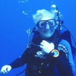

{: .image-float-left} Our second event will feature David Helvarg, the author of [_The Golden Shore_](https://www.amazon.com/Golden-Shore-Californias-Love-Affair/dp/0312664966/ref=as_li_ss_tl?s=books&ie=UTF8&qid=1471991691&sr=1-9&keywords=david+helvarg&linkCode=ll1&tag=codexmap-20&linkId=9d5cafc77c3b5739692719e2f5332eb0) and [_Saved by the Sea._](https://www.amazon.com/Saved-Sea-Heartbreak-Wonder-World-ebook/dp/B00V20LJOS/ref=as_li_ss_tl?s=books&ie=UTF8&qid=1471991691&sr=1-10&keywords=david+helvarg&linkCode=ll1&tag=codexmap-20&linkId=a992e3a0c2b91895b95eb2269ec35424)David is the Executive Director of Blue Frontier Campaign (www.bluefront.org). He is the winner of Coastal Living Magazine’s 2005 Leadership Award and the 2007 Herman Melville Literary Award. David has written a number of influential books about ocean-related issues, including Bue Frontier, The War Against the Greens, 50 Ways to Save the Ocean, Rescue Warriors, Saved by the Sea, and The Golden Shore - California's Love Affair with the Sea. In addition to his books, David is editor of the Ocean and Coastal Conservation Guide, organizer of the Peter Benchley Ocean Awards and Blue Vision Summits for ocean activists.

Special cocktails and food will be provided by award winning mixologist Christian Self of [Bevy](http://www.bevyhawaii.com/). [Ocean Vodka](http://www.oceanvodka.com/) is graciously providing us with spirits!

The ocean photography of [Rafael Bergstrom](http://www.raftography.com/) will be on display.

Your ticket includes two drinks, food, and admission to the event. There are a limited number of early admission tickets for a small reception with the author before the main event. The VIP reception begins at 6:30pm; general admission is at 7:00pm; and the main event starts at 7;30pm. The event will be held at [RevoluSun Smart Home](http://www.revolusun.com/) in Kaka'ako at 210 Ward Ave the evening of Sept. 8th. ([Map](https://www.google.com/maps/place/RevoluSun+Smart+Home/@21.2946221,-157.8616958,16.19z/data=!4m13!1m7!3m6!1s0x7c006df1f8650d73:0x4a05964d0c67c39f!2sRevoluSun+Smart+Home!3b1!8m2!3d21.2954579!4d-157.858027!3m4!1s0x7c006df1f8650d73:0x4a05964d0c67c39f!8m2!3d21.2954579!4d-157.858027)). Mahalo to RevoluSun Smart Home for making the space available!

**When you check out, you can also purchase a copy of Saved by the Sea and pick it up at the event;  David will sign your book at the event!**

You can [register for the event on Eventbrite](http://www.eventbrite.com/e/books-spirits-wauthor-david-helvarg-saved-by-the-sea-tickets-27292700201?aff=website). There are a limited number of early admission tickets for an intimate cocktail hour with the author before the main event. Details are available on the registration page. 

[**Get Tickets**](http://www.eventbrite.com/e/books-spirits-wauthor-david-helvarg-saved-by-the-sea-tickets-27292700201?aff=website)
