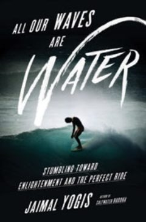
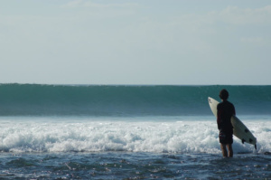

_(We're excited to let you know Jaimal Yogis, our first Books & Spirits author, has a new book out: [All Our Waves Are Water](http://www.jaimalyogis.com/allourwaves/), and even more excited to say he's **back in the islands in September** - you can see  him at a book signing at Barnes & Noble Ala Moana at 2 pm on Saturday September 16th and a talk and book signing at Lumeria Maui at 5 pm on September 17th. In celebration, we wanted to share with you a recent post by Jaimal, reposted with permission from [Spirituality & Health Magazine](https://spiritualityhealth.com/articles/2017/07/03/six-lessons-from-the-sea))._

 

 

 

* * *

After a couple of decades of surfing and traveling, and writing about surfing and traveling, these are six lessons that I use every day.

### 1\. The struggle is the joy.

Videos and films make surfers look like we’re always cruising around, carefree, on crystalline waves, no work involved. But _extremely little of each surf session is spent actually standing up on your surfboard on a wave_—maybe 1 percent. Most of the time you’re paddling until your shoulders feel like they’re being cattle-branded. If you’re looking to have a good time, it’s essential to find a way to enjoy paddling, or at least good-naturedly bear it. So surfing is life. The good stuff—chocolate and great sex and weddings and hilarious jokes—fills a minute portion of an adult lifespan. The rest of life is paddling: work, paying bills, flossing, getting sick, dying. But nobody ever found lasting joy from being fed beauty and riches and ease from a silver spoon. The sea has taught me that if I’m clear on where I’m going and why it’s good, _the struggle is the joy_. Plus, the burn helps you enjoy the good waves even more.

### 2\. Celebrate. Let go.

Because those exceptional waves come along only once in a blue moon, I think it’s important to celebrate them. Hoot, high-five, shake your butt. Too-cool-for-school stoicism isn’t any fun. Recent neuroscience shows that the more positive emotion we bring to an experience, the more neurons fire and wire together, leaving our brains more optimistic and open. The flip side, however, is that if the waves are perfect today, you can bet a storm is coming. Clinging to good conditions is like trying to hold the sea still. It leads to frustration. So dance, sing, toast. Then let go of its ever happening again.

### 3\. Never give up. Do question your approach.

My home break in San Francisco is notoriously difficult for paddling out. Complex wave fields, plus ferocious tidal currents, can, on big days, mean even the strongest surfers end up paddling for an hour and never making it out. But when you’ve been sprinting for 45 minutes—getting mashed into the sand by cold, angry wave after wave—if you just believe you will make it, if you keep going forward no matter how much it hurts, _you will get out there_.

Except when you don’t. When sheer grit and faith don’t work, get out of the water, catch your breath, question why that approach didn’t work, then look for a more favorable current that can help ferry you out—preferably one that’s working for another surfer. If that approach fails too, go home and have a cup of tea. You haven’t given up. All your paddling has put you in better shape for making it out tomorrow.

### 4\. Feed courage.

To get better at surfing and have the most fun, we need to challenge ourselves with more difficult waves. Courage is key. But courage is not the same as bravado. Courage stems from the French word cœur, heart. It’s tied to humanity’s need for novelty—to grow, learn, and love. Bravado is all about proving something because of hidden insecurity. Courage is patient. Courage trains, observes, selects the right board to match the type of waves, then paddles out in waves that are just at the edge of its ability. Bravado is repressed fear, so it’s impatient. It’s rushed. Bravado paddles out into surf it probably can’t handle just because the cameras are on. Bravado might bring some moments of fame, but it will eventually backfire: injury, loss of brain cells, early death. Courage is the long game.

### 5\. Be still. Be clear.

Humans are mostly water. Even our brains are about 80 percent water. The stillest water is the clearest, and there is a corollary for our aqueous brains. To find out what’s going on deep down—what we want, who we are, what we’re made of—we need stillness and clarity.

The sea calms itself by stopping the harsh winds, and we can calm ourselves with breath: meditation, yoga, prayer, stargazing, just sitting quietly on your board between waves. Whatever form it takes, stillness brings more steady breath. Steady breath brings clarity of mind. These moments of clarity don’t last. Life can be violent, murky, and stormy. But if we’ve stilled ourselves—and know the reef or rock formation that’s underneath that murk—when the monstrous rollers come off the horizon, we can ride them with confidence, or feel okay letting them pass.

### 6\. Accept yourself. Accept others.

Waves arise when air molecules, seeking pockets of low density, blow over water. Like goose bumps, wind forms ripples on the water’s skin, and those ripples act as sails, trapping more air. When wind is sustained, that energy congeals into hefty mounds of water. Swells. Energy in motion will stay in motion. So the swells travel, often for thousands of miles, sorting themselves as they move into tribes of similar speed and size, _sets_. From above, these sets appear like a parade of blue objects: hard, defined. But this is an illusion. Little water is moving.

The definition of a wave is a “disturbance moving through a medium,” and the memory of wind is spiraling through the medium of ocean. Atoms, molecules, cells are bouncing air’s message in an endless domino effect—a game of telephone. Each swell is a sort of illusion that only looks like firm matter in motion. And people are the same way. We look firm: head, shoulders, knees, and toes. But the bits of matter that compose our bodies are constantly getting traded out by new water, new food, new air, new chemicals. There is no static amount of stuff that stays with us from birth to death, no lump of clay you could point to and say, _See? Here I was as a baby, and now I’m stretched to my current size—roughly the same lump I began as_.

Just as the wave only exists as the memory of wind moving between particles, we are the memory of some primordial, beginningless exhalation—the cause that caused the cause of the Big Bang and every Big Bang before it. And we only exist as separate entities insofar as this breath has evolved us to perceive ourselves that way.

* * *

Jaimal Yogis is the author of [_All Our Waves Are Water: Stumbling Toward Enlightenment and the Perfect Ride_](http://amzn.to/2t9nFDZ), just published by Harper Collins.
